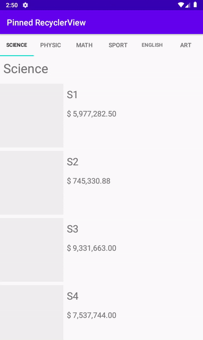
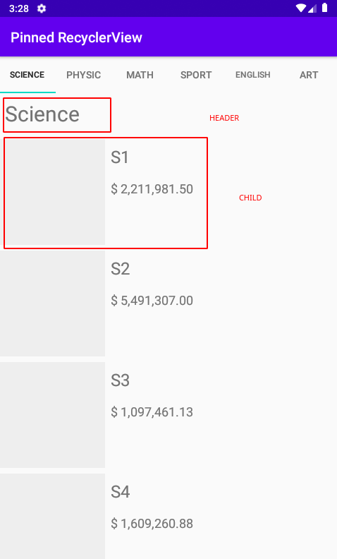

<h1 align="center">Pinned Recycler View</h1>

<p align="center">
<a href="https://jitpack.io/#Pidsamhai/pinnedrv/"> </a>
<a href="https://kotlinlang.org">&nbsp </a>
<a href="https://github.com/Pidsamhai/pinnedrv/blob/master/License.txt">&nbsp</a>
</p>

<p align="center">

</p>

# GetStart

## Jitpack

```text
allprojects {
  repositories {
    ...
    maven { url 'https://jitpack.io' }
  }
}
```

*  Gradle

```text
implementation 'com.github.Pidsamhai:pinnedrv:<latest-version>'
```

*  DSL

```text
implementation("com.github.Pidsamhai:pinnedrv:<latest-version>")
```

# Example 

* MainActivity

```kotlin
class MainActivity : AppCompatActivity() {

    override fun onCreate(savedInstanceState: Bundle?) {
        super.onCreate(savedInstanceState)
        setContentView(R.layout.activity_main)

        val dataSet = getMockData()

        val adapter = RecycleViewAdapter()
        recycleView.pinnedAdapter = adapter
        adapter.items.addAll(dataSet)
        adapter.notifyDataSetChanged()

        PinnedTabMediator(
            tabLayout,
            recycleView,
            { tab, position ->
                tab.text = (dataSet[position] as Category).categoryName
            }
        ).attach()

    }
}
```

* Adapter

```kotlin
class RecycleViewAdapter : PinnedRvAdapter<RecycleViewAdapter.VH>() {

    class VH(v: View): RecyclerView.ViewHolder(v)

    override fun onCreateViewHolder(parent: ViewGroup, viewType: Int): VH {
        return when (viewType) {
            HEADER -> VH(
                LayoutInflater.from(parent.context).inflate(R.layout.header, parent, false)
            )
            else -> VH(
                LayoutInflater.from(parent.context).inflate(R.layout.product, parent, false)
            )
        }
    }

    @SuppressLint("SetTextI18n")
    override fun onBindViewHolder(holder: VH, position: Int) {
        when (val item = items[position]) {
            is Header -> {
                (item as Category)
                holder.itemView.header.text = item.categoryName
            }
            is Child -> {
                holder.itemView.apply {
                    (item as Product)
                    name.text = item.name
                    price.text = "$ %,.2f".format(item.price)
                }
            }
        }
    }
}
```

* implement class Header and Child

```kotlin

data class Category(
    val categoryId: Int,
    val categoryName: String
) : Header()

data class Product(
    val productId: Int,
    val name: String,
    val cover: String,
    val price: Float
): Child()

```

<p align="center">

</p>

# License

```text
            DO WHAT THE FUCK YOU WANT TO PUBLIC LICENSE
                    Version 2, December 2004

 Copyright (C) 2020 Pidsamhai <meng348@gmail.com>

 Everyone is permitted to copy and distribute verbatim or modified
 copies of this license document, and changing it is allowed as long
 as the name is changed.

            DO WHAT THE FUCK YOU WANT TO PUBLIC LICENSE
   TERMS AND CONDITIONS FOR COPYING, DISTRIBUTION AND MODIFICATION

  0. You just DO WHAT THE FUCK YOU WANT TO.
```